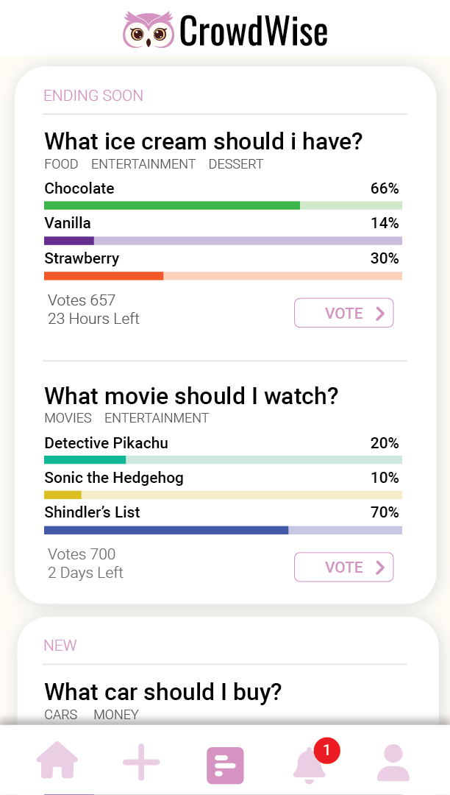
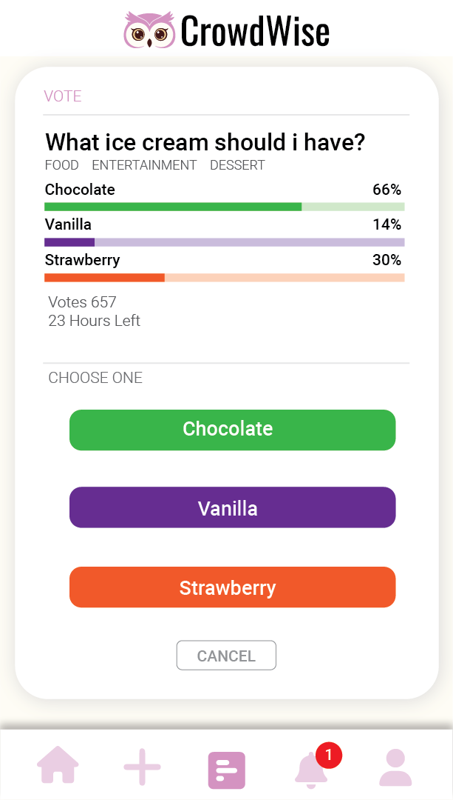
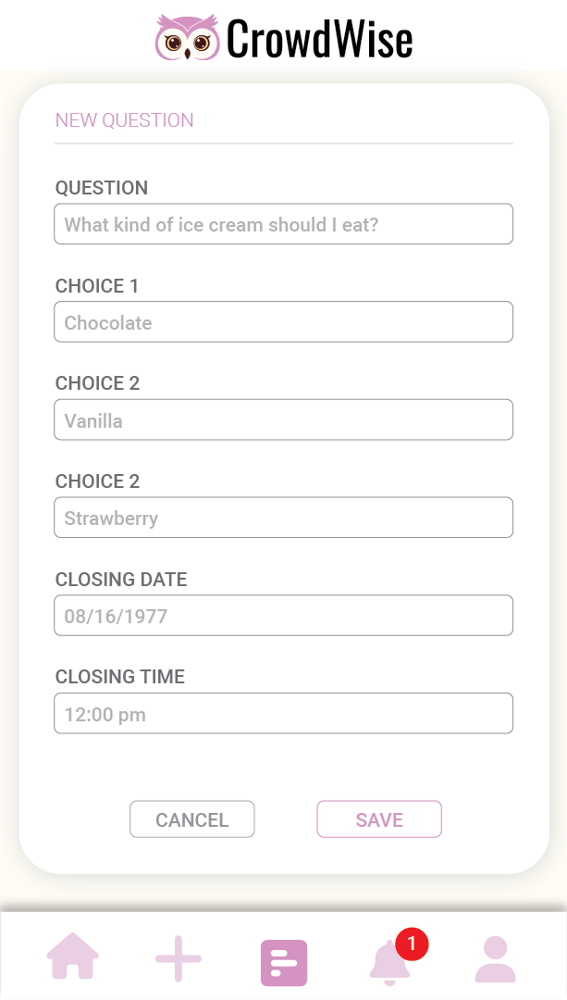
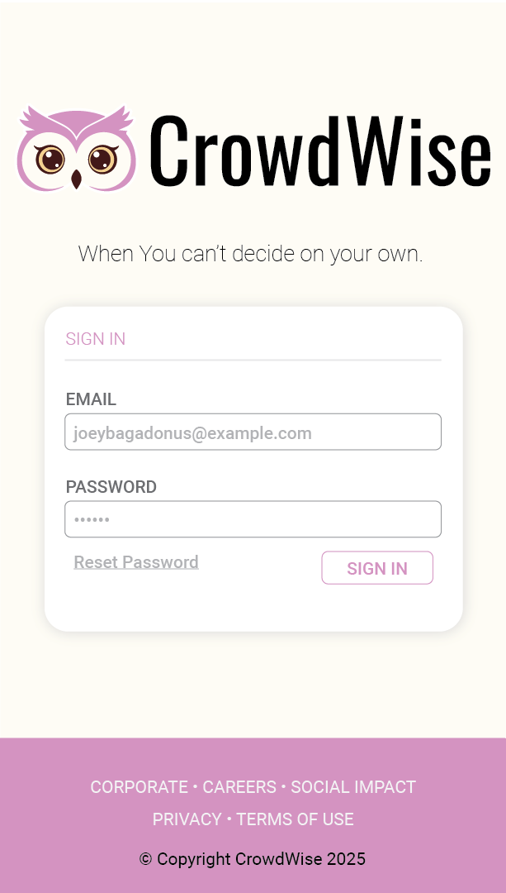

# crowdwise-part-1
CrowdWise is an applied learning project

## General Design info
Here are the specs

#### Fonts
There are only three fonts used in this design.
 - Oswald (google)
 - Roboto (google)
 - Font Awesome Free

 #### Logos
 All icons are actually FontAwesome. The CrowdWise Logo is provided as an SVG in the images folder.
 `images/crowdwise.svg`

#### Colors
The gray colors are all shades of gray which you can estimate. You can choose your own voting button colors, but they all need to be unique. The lighter shade is a transparency shift.

*These colors are required:*
- #d393c1 - CrowdWise Violet
- #ed1c24 - Alert Red
- #fefaf2 - Light Background Color

### Tips
Don't worry about hover states. Hover doesn't work on mobile anyway.

Code mobile first. Desktop views will be extra credit.

Code your HTML before starting the CSS

Use CSS class selectors and stylize sections as "components"

Use W3Schools.org, Mozilla.org, or CSS-tricks.com for reference.

Organize your work. Attack this challenge iteratively. Don't try to code the whole thing at once. Isolate the "sections" and test after coding.

Ask for help. If you are stuck on anything for longer than 8 minutes, ask me.

## Step 1
After cloning the repository, begin coding your home page (`index.html`). 

1. Code the HTML in "sections"
2. Code the HTML using class selectors

## Step 2
Code (HTML/CSS) the vote page. Reuse the header and footer HTML. Use the same CSS file for all pages.

## Step 3
Code (HTML/CSS) the new-question page. Reuse the header and footer HTML. Use the same CSS file for all pages.

## Step 4
Code (HTML/CSS) the sign-in page.

